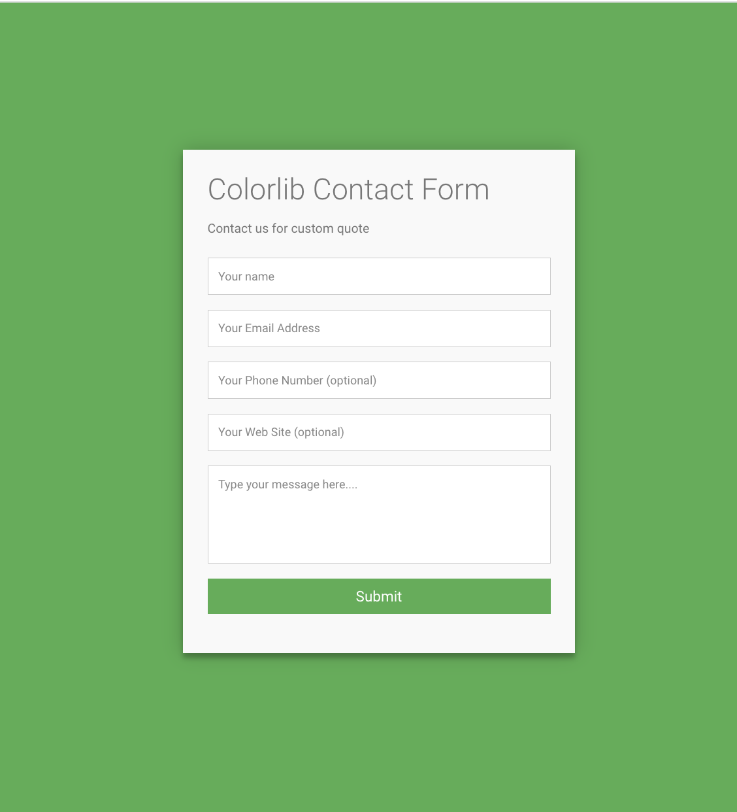
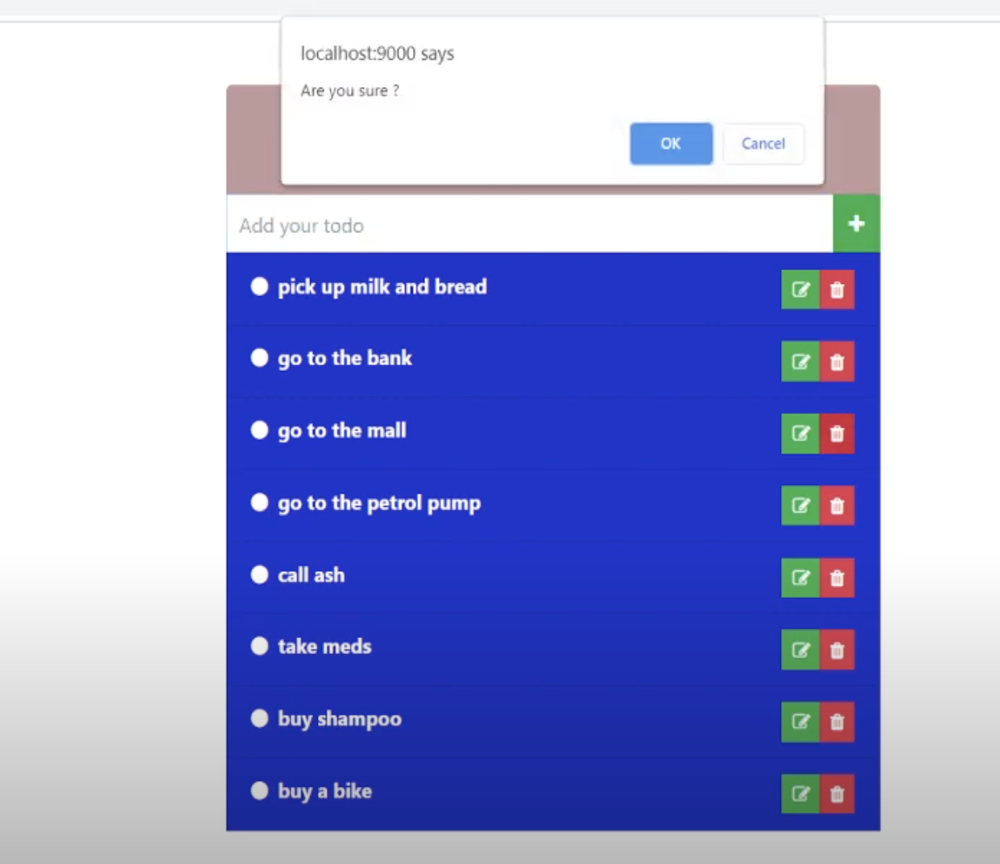

# Go Middleware (Basic)
This example will show how to create basic logging middleware in Go.
A middleware simply takes a http.HandlerFunc as one of its parameters, wraps it and returns a new http.HandlerFunc for the server to call.

# `Rooting`

    1. http://localhost:8080/
    2. http://localhost:8080/profile
    3. http://localhost:8080/fieldset
# `ScreenShot`

